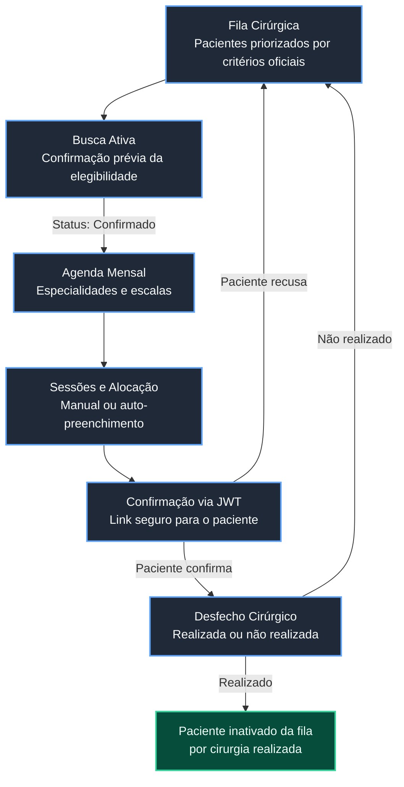
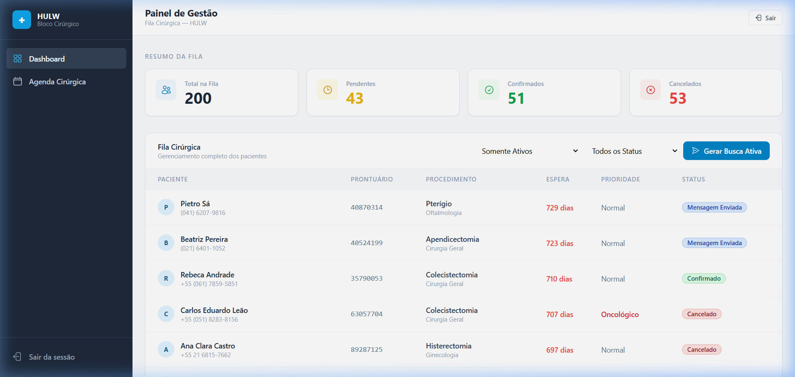
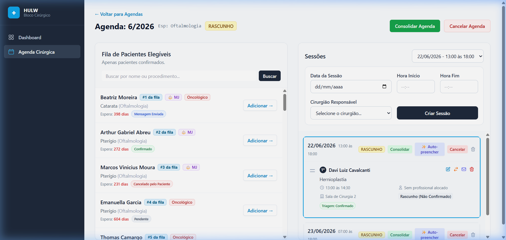
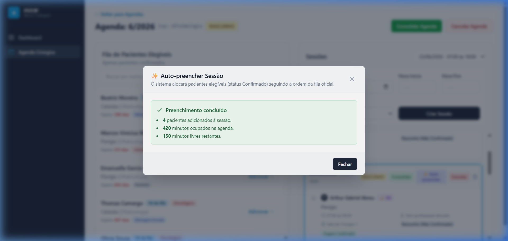

# Guia Visual do HULW Inteligente

## 1. Visão Geral

O **HULW Inteligente** é um sistema moderno de gestão de fluxo cirúrgico desenvolvido para otimizar e dar transparência ao agendamento de cirurgias eletivas no Hospital Universitário Lauro Wanderley (HULW). O principal objetivo do sistema é eliminar a dependência de processos manuais baseados em planilhas ou fichas de papel, organizando a fila de espera cirúrgica segundo critérios objetivos da instituição, otimizando o tempo útil dos cirurgiões e das salas de operação, e reduzindo o absenteísmo de pacientes por meio de confirmações digitais ativas.

### Módulos Principais

1. **Fila Cirúrgica Gerenciável:** Painel unificado para monitorar a fila de espera, priorizada automaticamente e filtrável por especialidade, médico e tipo de procedimento.
2. **Agenda Mensal por Especialidade:** Mapeamento de escalas de trabalho mensais divididas por especialidades, garantindo que o cirurgião aloque apenas pacientes elegíveis específicos daquela área de atuação.
3. **Gestão de Sessões Cirúrgicas:** Blocos de horários disponibilizados pelos cirurgiões responsáveis em datas específicas para alocação de cirurgias.
4. **Auto-preenchimento Inteligente:** Algoritmo automatizado que preenche sessões ociosas em segundos seguindo a ordem de prioridades oficiais da fila e calculando os horários ideais para cada procedimento.
5. **Portal do Paciente (Triagem e Confirmação):** Canal digital direto onde o paciente recebe as orientações pré-operatórias e confirma ou recusa o agendamento através de links protegidos por JWT.
6. **Controle de Desfechos:** Registro auditável dos resultados operacionais no dia planejado da cirurgia (realizada ou cancelada com justificativa).

---

## 2. Fluxo Geral do Sistema

O fluxo cirúrgico no HULW Inteligente segue um ciclo de vida estruturado e transparente:

1. **Fila Cirúrgica:** Pacientes entram na fila e são ordenados seguindo as regras de negócio clínicas e judiciais.
2. **Busca Ativa:** Equipe de triagem faz contato preliminar com o paciente. Se o paciente manifestar capacidade/interesse, seu status de busca ativa passa a **Confirmado**.
3. **Agenda Mensal:** O gestor abre agendas mensais divididas por especialidades (ex: Oftalmologia, Ortopedia).
4. **Sessões e Alocação:** Dentro da agenda, são adicionadas as sessões de disponibilidade do cirurgião. O gestor pode alocar pacientes manualmente ou rodar o **Auto-preenchimento** da fila de confirmados elegíveis.
5. **Confirmação do Paciente:** O sistema gera um link seguro com token JWT. O paciente abre em seu dispositivo mobile para confirmar a cirurgia (status: _Cirurgia Agendada_) ou recusar com justificativa.
6. **Desfecho Cirúrgico:** No dia da cirurgia, o gestor marca o evento como realizado (inativa paciente da fila por sucesso) ou não realizado (o paciente volta para a fila mantendo sua antiguidade original).

---

## 3. Fila Cirúrgica

### 3.1 Painel Admin da Fila Cirúrgica

**Print:**

**Descrição:**
A imagem exibe o painel principal administrativo do HULW. No topo, há quatro cartões de KPIs acumulados ("Total na Fila", "Aguardando Contato", "Confirmados" e "Recusados"). Abaixo, o painel exibe controles de busca rápida, filtros suspensos de especialidade, procedimento, prioridade clínica e uma listagem tabulada de pacientes ativos na fila, detalhando posição, nome, especialidade, procedimento, prioridade, data de entrada e tempo de espera acumulado em dias.

**Funcionalidade demonstrada:**
Exibição unificada, filtrável e em tempo real do status da fila de espera de cirurgias no HULW.

**Regra de negócio envolvida:**

- **Priorização oficial:** Medidas judiciais (marcadas com `⚖️ MJ` e cor roxa) aparecem no topo de suas categorias, seguidas por Oncológicos (`ONC`), Breve Retorno (`BRE`) e, por fim, pacientes sem prioridade especial (`SEM`), classificados pela data de entrada mais antiga.
- **Nota de Usabilidade:** Durante a simulação de varredura, observou-se que a listagem central do painel exibe a ordenação de prioridades clínicas baseada no tempo máximo corrido, necessitando de filtro por especialidade no painel lateral de Agendas para correlação precisa de posições nos agendamentos por especialidade.

**Importância no fluxo:**
É a tela central de controle onde os gestores de saúde acompanham o tamanho da demanda, gargalos nas triagens e o cumprimento das ordens cronológicas e legais.

---

## 4. Agenda Mensal por Especialidade e Alocação

### 4.1 Agenda de Oftalmologia - Detalhes

**Print:**

**Descrição:**
A imagem exibe a tela detalhada de uma agenda mensal da especialidade de **Oftalmologia**. À esquerda, há uma lista dedicada de pacientes elegíveis daquela especialidade com filtros locais. À direita, aparecem os blocos de sessões cirúrgicas cadastradas para o mês (ex: sessão da tarde sob responsabilidade de cirurgiões específicos). O painel mostra o paciente _Arthur Gabriel Abreu_ pré-agendado na sessão.

**Funcionalidade demonstrada:**
Visualização e controle de agendas cirúrgicas específicas por especialidade médica, exibindo pacientes elegíveis do lado esquerdo e o grid de sessões programadas no lado direito.

**Regra de negócio envolvida:**

- **Isolamento por Especialidade:** Pacientes elegíveis de especialidades diferentes (como Ortopedia ou Cirurgia Geral) são ocultados automaticamente da lista lateral esquerda nesta tela.
- **Vínculo Fila-Agenda:** A fila lateral esquerda exibe a posição oficial que o paciente oftalmológico ocupa em relação aos seus pares da mesma especialidade.

**Importância no fluxo:**
Organiza o ecossistema cirúrgico dividindo o hospital em seus respectivos departamentos médicos, permitindo ao gestor planejar os blocos operatórios com precisão cirúrgica sem misturar especialidades.

---

## 5. Auto-preenchimento de Sessão Cirúrgica

### 5.1 Relatório de Auto-preenchimento

**Print:**

**Descrição:**
A imagem exibe o modal popup com o **Relatório de Processamento** gerado após clicar no botão `✨ Auto-preencher`. O relatório resume:

- **Novos itens adicionados:** 1 paciente alocado.
- **Ocupação do tempo:** 90 minutos preenchidos da sessão, restando 210 minutos ociosos.
- **Pacientes ignorados e motivos:** Exibe a tabela detalhando quais pacientes da fila foram desconsiderados e os motivos técnicos que causaram o descarte na sessão (por exemplo, status do contato/busca ativa que não fosse `CONFIRMADO_PACIENTE` ou tempos de procedimento incompatíveis com o limite do bloco restante).

**Funcionalidade demonstrada:**
Algoritmo de alocação sequencial e transacional que monta e preenche automaticamente o mapa da sessão em lote com base em dados em tempo real da fila.

**Regra de negócio envolvida:**

- **Filtro de busca ativa:** Apenas pacientes que responderam previamente ao hospital e possuem o status de busca ativa como **CONFIRMADO_PACIENTE** são alocados no auto-preenchimento automático.
- **Verificação de conflito:** O algoritmo realiza validação em bloco contra conflito de sala cirúrgica ocupada e duplicidade de cirurgião operando em outra sala simultaneamente.
- **Estratégia de Encaixe:** Se o procedimento do próximo paciente da fila exceder o horário final da sessão cirúrgica, o sistema passa para o próximo elegível com cirurgia mais curta que caiba no tempo restante (se a flag "pular se não couber" estiver ativa).

**Importância no fluxo:**
Representa a maior economia de tempo administrativo do sistema, otimizando o uso das salas cirúrgicas em poucos cliques com garantia de conformidade com a fila cronológica.

---

## 6. Geração de Links de Confirmação JWT

### 6.1 Geração de Link Seguro para WhatsApp

**Funcionalidade:**
O sistema gera o link para o paciente. O link gerado possui o formato de destino `/confirmar-cirurgia?token=ey...` contendo uma chave criptografada em padrão JWT. Trata-se de um mecanismo de geração e distribuição de links mágicos para confirmação ativa do paciente.

**Regra de negócio envolvida:**

- **Autenticação Segura sem Login:** O token JWT carrega informações do ID de alocação de forma encriptada, dispensando o paciente de realizar login com usuário e senha ou expor seu CPF/Prontuário de saúde na URL de acesso.
- **Validade Temporal:** O token possui validade expiráveis (72 horas) para evitar confirmações fora de prazo.

**Importância no fluxo:**
Garante a conformidade com a LGPD ao mesmo tempo em que oferece uma interface simples e sem fricção para o paciente responder diretamente pelo celular.

---

## 7. Portal do Paciente (Mobile)

### 7.1 Tela de Confirmação do Paciente

**Funcionalidade:**
Triagem digital direta com o paciente para verificação de dados e aceitação do procedimento cirúrgico.

**Regra de negócio envolvida:**

- **Consentimento Ativo:** O paciente é corresponsável pelo agendamento. Se ele clicar em **Confirmar**, o sistema atualiza a agenda no painel administrativo instantaneamente para o status **CIRURGIA_AGENDADA**.
- **Motivo de Recusa:** Se o paciente clicar em **Recusar**, um formulário secundário captura o motivo (temporário ou definitivo) para atualização automática da sua posição de atividade na fila oficial.

**Importância no fluxo:**
Ponto crucial de contato que reduz drasticamente o absenteísmo cirúrgico (pacientes que não comparecem no dia), além de manter o hospital ciente de imprevistos clínicos com dias de antecedência.

---

## 8. Segurança e LGPD

O sistema foi estruturado sob o conceito de _Privacy by Design_ para garantir a segurança de dados e a privacidade do paciente:

1. **Links sem PII (Personally Identifiable Information):** As URLs enviadas aos pacientes não expõem nomes, CPFs, RGs ou número de prontuário. Toda a referência ao item e paciente é codificada no payload criptografado do JWT.
2. **Minimização de Dados:** A tela do paciente exibe somente as informações indispensáveis para o comparecimento do paciente e segurança do procedimento.
3. **Auditoria de Eventos:** O histórico do paciente registra de forma permanente quem realizou cada alocação, datas de envio de mensagens e as respostas fornecidas, assegurando rastreabilidade total.

---

## 9. Principais Regras de Negócio e Conflitos

- **Duplicidade de Paciente:** O sistema impede que o mesmo paciente seja alocado em duas sessões cirúrgicas ativas simultâneas.
- **Conflito de Recursos (Sala):** O sistema impede o agendamento de mais de um procedimento na mesma sala cirúrgica no mesmo horário.
- **Conflito de Recursos (Cirurgião):** Bloqueia a escalação de um cirurgião responsável em salas diferentes em horários sobrepostos.
- **Cálculo de Horários:** Utiliza o valor `tempo_medio_minutos` do procedimento cadastrado para desenhar o grid do dia. Caso o procedimento não tenha duração média cadastrada no banco, assume o fallback padrão de 90 minutos.
- **Desfecho e Fila:**
  - Cirurgia Realizada: Inativa a entrada do paciente na fila cirúrgica definitivamente com status de sucesso.
  - Cirurgia Cancelada (Motivo Institucional/Clínico): O paciente permanece ativo e mantém sua data de entrada original na fila.

---

## 10. Limitações Atuais e Próximos Passos

A versão atual da plataforma HULW Inteligente possui bases robustas, mas apresenta oportunidades claras de evolução tecnológica:

1. **Disparo Direto via WhatsApp:** Implementar o envio automático de mensagens via API oficial do WhatsApp (atualmente o link é gerado em modal para cópia manual pela equipe).
2. **Integração com AGHUx:** Conectar a base de dados diretamente ao prontuário eletrônico institucional (AGHUx) para sincronização automática de laudos e desfechos pós-alta.
3. **Motor Prescritivo Avançado:** Utilizar inteligência artificial para agrupar cirurgias por afinidade de instrumental esterilizado e otimização de tempo de higienização de salas.
